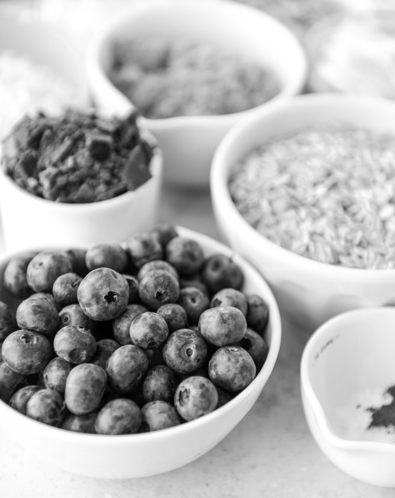

# Low-Poly Generator

Low poly generator is an automatic approach for generating low poly images.

To make this work, first we need to get grayscale of any certain image. Like below, we chose a pretty colorful and appetizing picture:

To get grayscale of any image, we just need to get the average value of every pixel point's RGB value. We can do this by iterating through the pixels of the whole image. and we get:

This will make edge detection much easier by using black-and-white pictures. By implementing Sobel's edge detection algorithm, we get:

And finally by implementing Delaunay Triangulation algorithm, and fill in original picture's color into every triangle, we get:

